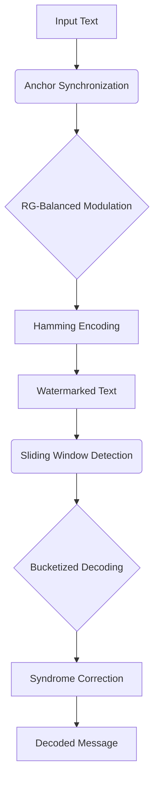

```markdown
# ARGH-Mark: Anchor-Synchronized Watermarking for LLM Attribution

Official implementation of **ARGH-Mark** from the AAAI 2026 paper:  
*"Anchor-Synchronized Watermarking with Hamming Correction for Robust and Quality-Preserving LLM Attribution"*

## Key Features

- **Triad Architecture**  
  ✓ Anchor synchronization for deletion robustness  
  ✓ RG-balanced vocabulary modulation  
  ✓ Hamming-based error correction  

- **State-of-the-Art Performance**  
  ✓ 96.2% F1 under 30% deletion attacks  
  ✓ 17.9× bit recovery gain at BER=0.2  
  ✓ 40ms detection latency  

- **Alignment-Ready**  
  ✓ Cryptographic-grade attribution  
  ✓ Negligible quality degradation (ΔKL < 0.08)  
  ✓ Compliant with EU AI Act transparency requirements  

## Installation

```bash
pip install argmark
```

Or from source:
```bash
cd ARGH
pip install -e .
```

## Quick Start

### Watermark Embedding
```python
from argmark import ARGHWatermarker
from transformers import AutoModelForCausalLM, AutoTokenizer

model = AutoModelForCausalLM.from_pretrained("meta-llama/Llama-3-8B")
tokenizer = AutoTokenizer.from_pretrained("meta-llama/Llama-3-8B")

watermarker = ARGHWatermarker(
    anchor="101",      # Synchronization code
    delta=2.0,        # Modulation strength
    period=5,         # Anchor insertion interval
    vocab_size=tokenizer.vocab_size
)

prompt = tokenizer("Explain quantum computing:", return_tensors="pt").input_ids
message = "11001010"  # 8-bit model fingerprint

# Generate watermarked text
output = model.generate(
    inputs=prompt,
    watermarker=watermarker,
    message=message,
    max_length=200
)
```

### Watermark Detection
```python
from argmark import ARGHDetector

detector = ARGHDetector(
    anchor="101",
    period=5,
    vocab_size=tokenizer.vocab_size,
    theta_sync=0.85,    # Anchor matching threshold
    theta_bucket=0.6     # Bit decoding threshold
)

decoded_msg, confidence = detector.detect(output)
print(f"Decoded: {decoded_msg} (Confidence: {confidence:.1%})")
```

## Advanced Usage

### Low-Resource Language Adaptation
```python
# Language-specific delta calibration (Appendix G.1)
watermarker.delta = watermarker.adaptive_delta(language="sw")  # Swahili
```

### Adaptive Attack Defense
```python
# Enable LSTM-based dynamic anchors (Appendix G.2)
watermarker.enable_dynamic_anchors(lstm_hidden_dim=128)
```

### Alignment Verification
```python
# Compute jailbreak detection score (Appendix G.3)
score = detector.alignment_monitoring(
    generated_text,
    harmful_phrases=["jailbreak", "bypass", "ignore safety"]
)
```

## Reproducing Paper Results

1. Download the WaterMark-10K benchmark:
```bash

unzip WaterMark-10K.zip
```

2. Run evaluation scripts:
```bash
python eval/robustness.py --attack deletion --intensity 0.3
python eval/quality.py --dataset elis --model llama-3-8b
```

## Architecture




## Example of Result :
=== ARGH-Mark Dataset Evaluation ===
Loading model from: ./models/gpt2-xl
Model loaded successfully!
Loaded 1000 samples from dataset
Processing sample 1/100
Sample 1: No valid detection (decoded='0000', confidence=0.000), EmbedTime=0.01s, DetectTime=0.96s, TotalTime=0.97s
Processing sample 2/100
Token indices sequence length is longer than the specified maximum sequence length for this model (1581 > 1024). Running this sequence through the model will result in indexing errors
Sample 2: Decoded=1111, Confidence=0.875, BitAcc=0.500, EmbedTime=0.01s, DetectTime=1.43s, TotalTime=1.44s
Processing sample 3/100
Sample 3: No valid detection (decoded='0000', confidence=0.000), EmbedTime=0.00s, DetectTime=0.62s, TotalTime=0.62s
Processing sample 4/100
Sample 4: Decoded=0100, Confidence=0.875, BitAcc=0.750, EmbedTime=0.00s, DetectTime=0.50s, TotalTime=0.50s
Processing sample 5/100
Sample 5: No valid detection (decoded='0001', confidence=0.000), EmbedTime=0.00s, DetectTime=0.66s, TotalTime=0.66s
...
...
...
Processing sample 96/100
Sample 96: Decoded=0000, Confidence=0.875, BitAcc=0.500, EmbedTime=0.00s, DetectTime=0.30s, TotalTime=0.30s
Processing sample 97/100
Sample 97: No valid detection (decoded='0000', confidence=0.000), EmbedTime=9.62s, DetectTime=0.26s, TotalTime=9.88s
Processing sample 98/100
Sample 98: No valid detection (decoded='0000', confidence=0.000), EmbedTime=0.00s, DetectTime=0.60s, TotalTime=0.60s
Processing sample 99/100
Sample 99: No valid detection (decoded='0000', confidence=0.000), EmbedTime=0.00s, DetectTime=1.02s, TotalTime=1.02s
Processing sample 100/100
Sample 100: No valid detection (decoded='1001', confidence=0.000), EmbedTime=0.00s, DetectTime=1.36s, TotalTime=1.36s

=== Evaluation Results ===
Total samples processed: 100
Valid detections: 45
Match Rate: 0.030 (3/100)
Average Bit Accuracy: 0.544
Detection Success Rate: 0.450

=== Time Performance ===
Average embedding time per sample: 0.3235 seconds
Average detection time per sample: 0.6588 seconds
Average total processing time per sample: 0.9823 seconds
Total processing time for all samples: 98.23 seconds
Our average detection latency: 658.82ms